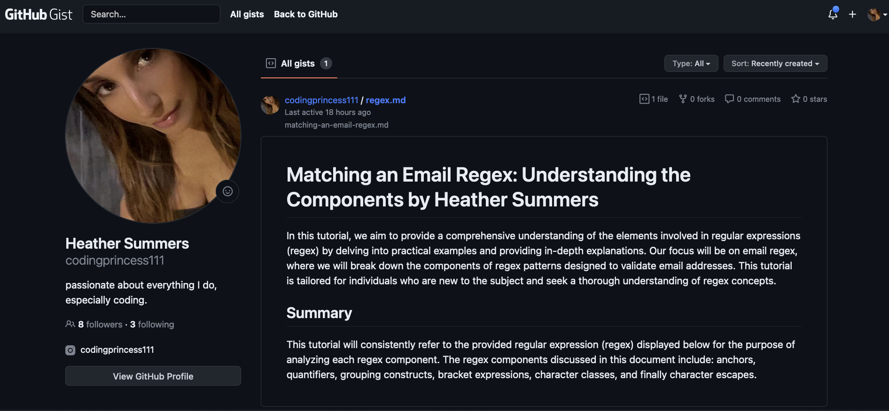

# Regex In Javascript Tutorial

## Description 
The tutorial showcases the regex `/^([a-z0-9_.-]+)@([\da-z.-]+).([a-z.]{2,6})$/,` explaining each component in detail. By breaking down the regex, we make the validation process easier to grasp. After completing this tutorial, you'll have a solid understanding of how the regex works and be able to validate and confirm the entry of a valid email address more confidently.

**GitHub Gist: [Click Here](https://gist.github.com/codingprincess111/d95954b18d6758938cf182dba85e347a)**

## Table of Contents:
- [Overview](#Overview)
- [The Challenge](#The-Challenge)
- [Installation Process](#Installation-Process)
- [What I Learned](#What-I-Learned)
- [Author](#Author)

# Overview

## The Challenge 

In this challenge, you will leverage the knowledge acquired from the tutorial and put it into practice by creating a detailed tutorial on email validation using regular expressions (regex). To accomplish this, the following steps were executed:

1. Conducted an extensive review of existing literature regarding the structure and format of email addresses.
2. Utilized information obtained from reputable, peer-reviewed sources to identify the essential components that require validation in an email address.
3. Formulated a regular expression (regex) pattern specifically designed to validate email addresses, taking into account the identified components.
4. Created a GitHub Gist and followed the instructions provided in the "Installation Process" section to set it up.
5. Within the newly created Gist, composed a concise explanation of the regex pattern developed for email validation, elucidating the purpose and function of each component. This explanation was crafted with consideration for both novice coders and fellow academics, and was informed by authoritative academic sources.
6. Shared the Gist link with others to foster collaborative discussions, encouraging diverse perspectives and interpretations of the regex pattern.

**Sources**

1. W3Resource. (n.d.). JavaScript: HTML Form - email validation. https://www.w3resource.com/javascript/form/email-validation.php
2. Matching an email address validation using Regular Expression pattern. https://www.youtube.com/watch?v=X0vLnADsF4w
3. Regular Expressions: Capturing Groups. https://www.youtube.com/watch?v=c9HbsUSWilw
4. Harvard University. (2022). CS50's Web Programming with Python and JavaScript. https://cs50.harvard.edu/python/2022/weeks/7/
 

These sources provided valuable information on the construction and usage if regex patterns for email validation.

### Deployed Public GitHub Gist Screenshot

## Installation Process:
**Set up a GitHub Gist**

1. Sign into GitHub.
2. Visit https://gist.github.com/ to create a new gist.
3. In the "Gist description" field, enter a brief description of the challenge, such as "Email Regex Challenge".
4. Add a new file to the Gist.
5. Write brief explanation of the Regex, describe each component and its purpose in the email validation process.
6. Explain how the regex can be modifieed to accept new requirements - special characters, uppercase/lowercase letters in the email.
7. Save Gist by clicking onm "Create public Gist" or "Create Secret Gist".
8. Share link or move into existing repositiory.

## What I Learned

1. How to deploy my 1st Gist.
2. Understanding the components of regex patterns for email validation.
3. Thorough breakdown on regex components.
4. Capability to communicate the regex usage and validation techniques. 

## Challenges

1. Intigrate Gist repo into new repo 

## Author

Follow me on GitHub at [codingprincess111](https://github.com/codingprincess111)
 
Deployed GitHub-Gist Link: [Deployed GitHub-Gist Link: Click Here](https://gist.github.com/codingprincess111/d95954b18d6758938cf182dba85e347a)
 
GitHub Repository: [GitHub Repository: Click Here](https://github.com/codingprincess111/Regex-in-JavaScript-Tutorial)
